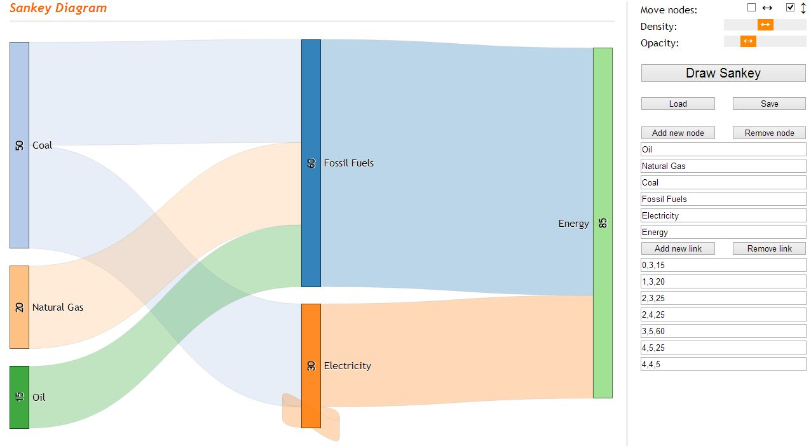

[  Sankey Diagram Generator](http://sankey.csaladen.es/)
======
  
  
- Written in HTML5, CSS3 and D3.js
- Can move nodes freely around the canvas
- Can adjust link opacity and node spacing
- Automatically adjusts to screen size
- Works on all devices and renders the same
- Load/Save functionality in JSON, PNG formats

# App
Try: http://sankey.csaladen.es  

# Documentation 
https://csaladenes.wordpress.com/2014/11/06/sankey-diagram-generator/
   
# Credit
Dénes Csala, 2014  
http://csaladen.es
